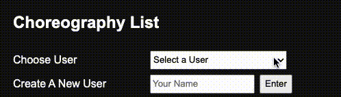
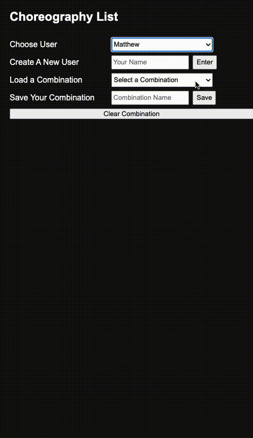

# phase-1-Project-Tap-Dance-Dictionary

This is a searchable dictionary of common American Tap Dance movements.

## Description

This dictionary is a (not exhaustive) list of common American Tap Dance movements, meant for tap dance instructors and choreographers to easily reference and search for moves. It can be searched by name of move and by the number of sounds in a move. For instance, a Shuffle would have 2 sounds, as would a Flap!

Use this app to search for move definitions, or as a thesaurus of sorts to find alternative moves with similar sounds! The dictionary is presented with main moves in all capitals, and alternate versions or iterations of that move indented below.

The sidebar "Choreography List" section is available to build your own combinations in the app! Simply click the "+" button next to a move to add it to your combo. To remove a move from your combo, click the "x" button next to that move. You can even drag and drop moves to change the order!

To save your combination, either select your username or create a new username, and then give your combination a name and click "Save". To load previously saved combinations, select one from the "Select a Combination" dropdown menu. You can update saved combinations simply by making changes to the combo, then clicking "Save".

Explore, create, and enjoy!

## Installation

<!-- No installation is needed. This is an interactive web app. -->

For now, this requires loading the project's db.json database, and using json-server from your local Terminal or Command Line. This section will be updated when database hosting has been brought online and needs no local server.

## Searching

Navigate to the hosted page: https://mkennedyakgrown.github.io/phase-1-Project-Tap-Dance-Dictionary/

Search for the name of a move using the Search By Name form, or search for moves by the number of sounds they include by using the Search By Number of Sounds form at the top of the page.

If you want to view the full dictionary again, click the "Clear Search" button.

## Choreography List

To add a move to the Choreography List in the sidebar, click the "+" button next to your desired move.

To remove a move from the Choreography List, click the "x" button next to that move in the sidebar.

You can reorder the moves in your combination by dragging and dropping moves in your list.

## Saving Choreography

To save your combination, you must select a User. If you do not yet have a username, you can create one using the "Create A New User" form! Enter your name, then click the "Enter" button next to that form. Now you can select your name in the dropdown menu!

To save your combination, give it a name in the "Save Your Combination" form, then click the "Save" button next to that form.

You can load previously saved combinations by selecting them from the "Load a Combination" dropdown menu. Don't see your saved combinations? Make sure you have selected your username in the "Choose User" dropdown menu!

## Acknowledgements

List of American Tap Dance Moves was sourced from https://tapdancedictionary.com/

## License

[MIT](https://choosealicense.com/licenses/mit/)